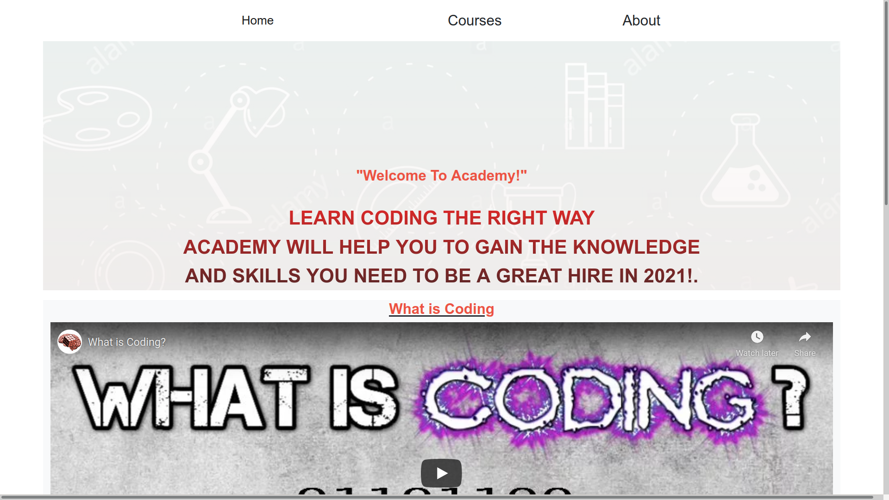

# Academy

Academy website for web development and programming courses this is the capstone project of the html and css module,
The project build upon a design provided by Cindy Shin and has been personalized to align with the business vision. 

## Built With

- HTML
- CSS
- Bootstrap

## Live Demo

[Live Demo Link](https://deevlopacademy.netlify.app/)

[Live Video Demo Link](https://www.loom.com/share/2ba39e8fa1a34a40b1e4a4b32c617f85)

## Getting Started

**Clone the project or Download the zip folder**
**Open the html file with your browser**

## Authors

👤 **Author1**

- GitHub: [@githubhandle](https://github.com/Shaher-11/)
- Twitter: [@twitterhandle](https://twitter.com/ShaherShamroukh/)
- LinkedIn: [LinkedIn](https://www.linkedin.com/in/shaher-shamroukh/)

## 🤝 Contributing

Contributions, issues, and feature requests are welcome!

Feel free to check the [issues page](issues/).

## Show your support

Give a ⭐️ if you like this project!

## Acknowledgments

- Cindy Shin
- Microverse

## 📝 License

This project is [MIT](lic.url) licensed.
